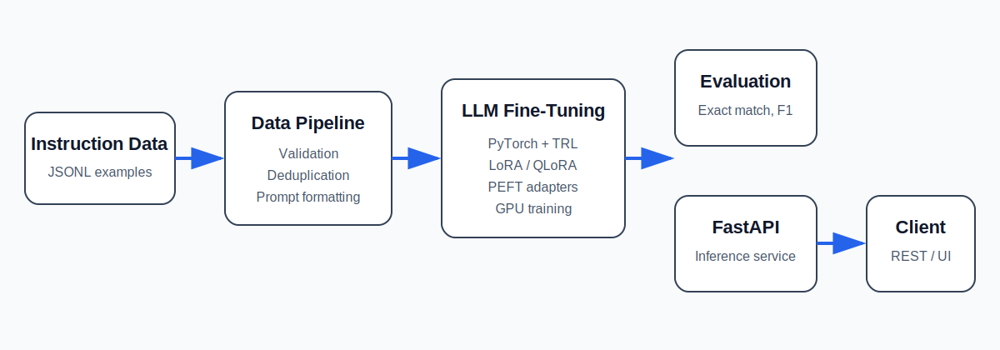
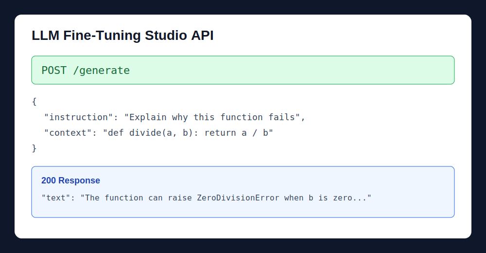
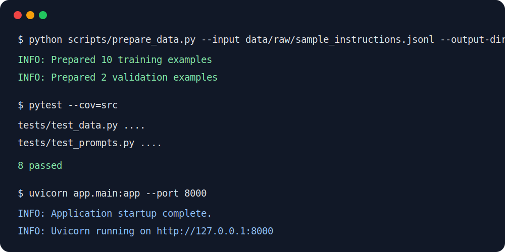

# LLM Fine-Tuning Studio

[](https://www.python.org/)
[](https://pytorch.org/)
[](https://fastapi.tiangolo.com/)
[](https://www.docker.com/)
[](https://github.com/ParisaArbab/llm-finetuning-studio/actions)
[](LICENSE)

## Short Description

LLM Fine-Tuning Studio is a production-style Generative AI system for adapting open-source language models with LoRA and QLoRA. It solves the high cost of full-model fine-tuning by providing a memory-efficient pipeline for data preparation, supervised training, evaluation, and API deployment.

## Features

- ✅ Instruction dataset validation and deduplication
- ✅ LoRA and 4-bit QLoRA fine-tuning
- ✅ Configurable GPU and lightweight CPU workflows
- ✅ Prompt formatting for supervised fine-tuning
- ✅ Exact-match and token-level F1 evaluation
- ✅ Adapter-based model inference
- ✅ FastAPI REST API
- ✅ Docker deployment
- ✅ Unit tests, coverage, and GitHub Actions CI
- ✅ Reusable YAML experiment configurations

## Architecture Diagram



## Tech Stack

| Area | Technologies |
|---|---|
| Language | Python |
| Deep Learning | PyTorch |
| LLM Framework | Hugging Face Transformers |
| Fine-Tuning | PEFT, LoRA, QLoRA, TRL |
| Data | Hugging Face Datasets, JSONL |
| API | FastAPI, Uvicorn, Pydantic |
| Deployment | Docker |
| Quality | Pytest, pytest-cov, GitHub Actions |

## Skills Demonstrated ⭐

- PyTorch
- Hugging Face Transformers
- PEFT
- LoRA and QLoRA
- TRL supervised fine-tuning
- Deep learning
- Model fine-tuning
- Prompt engineering
- LLM evaluation
- GPU training and quantization
- FastAPI and REST APIs
- Docker
- Unit testing and coverage
- CI/CD
- Python software engineering
- Configuration management

## Project Structure

```text
llm-finetuning-studio/
├── app/                    # FastAPI inference application
├── configs/                # CPU and QLoRA experiment settings
├── data/
│   ├── raw/                # Source instruction dataset
│   └── processed/          # Generated train/validation splits
├── docs/
│   └── assets/             # Architecture and example screenshots
├── scripts/                # Prepare, train, evaluate, and chat commands
├── src/llm_finetuning/     # Reusable Python package
├── tests/                  # Unit tests
├── .github/workflows/      # CI pipeline
├── Dockerfile
├── LICENSE
├── Makefile
├── pyproject.toml
└── requirements.txt
```

## Installation

```bash
git clone https://github.com/ParisaArbab/llm-finetuning-studio.git
cd llm-finetuning-studio
python -m venv .venv
source .venv/bin/activate
pip install -r requirements.txt
pip install -e .
```

On Windows, activate the environment with:

```bash
.venv\Scripts\activate
```

Prepare the dataset:

```bash
python scripts/prepare_data.py --input data/raw/sample_instructions.jsonl --output-dir data/processed
```

Run the lightweight validation workflow:

```bash
python scripts/train.py --config configs/train_cpu_demo.yaml
```

Run QLoRA on a CUDA GPU:

```bash
python scripts/train.py --config configs/train_qlora.yaml
```

## Usage

Start the API:

```bash
export BASE_MODEL=Qwen/Qwen2.5-1.5B-Instruct
export ADAPTER_PATH=outputs/qwen-software-assistant
uvicorn app.main:app --host 0.0.0.0 --port 8000
```

Send a generation request:

```bash
curl -X POST http://localhost:8000/generate \
  -H "Content-Type: application/json" \
  -d '{
    "instruction": "Explain why this Python function fails.",
    "context": "def divide(a, b): return a / b",
    "max_new_tokens": 150,
    "temperature": 0.2
  }'
```

Interactive command-line chat:

```bash
python scripts/chat.py --base-model Qwen/Qwen2.5-1.5B-Instruct --adapter-path outputs/qwen-software-assistant
```

## Screenshots

### API Request and Response



### Terminal Workflow



## Example Output

The following is an illustrative API response format. Actual wording depends on the selected base model and trained adapter.

```json
{
  "text": "The function can raise ZeroDivisionError when b is zero. Validate b before division and return a clear error or raise ValueError.",
  "base_model": "Qwen/Qwen2.5-1.5B-Instruct",
  "adapter_path": "outputs/qwen-software-assistant"
}
```

Example evaluation report:

```json
{
  "number_of_examples": 50,
  "average_exact_match": 0.0,
  "average_token_f1": 0.0,
  "examples": []
}
```

The zero values above are placeholders that show the report schema, not claimed model results. Run the evaluation command to create measured results for your trained adapter.

## How It Works

The system reads instruction-response examples from JSONL files, validates and removes duplicate records, and creates training and validation splits. A prompt builder converts each record into supervised fine-tuning text. TRL trains small LoRA adapter weights while the original language model remains frozen. With QLoRA, the base model is also loaded in 4-bit format to reduce GPU memory. The saved adapter is evaluated on held-out examples and loaded by FastAPI for REST-based inference.

```text
Instruction Data
      ↓
Validation and Deduplication
      ↓
Prompt Formatting
      ↓
LoRA or QLoRA Fine-Tuning
      ↓
Adapter Checkpoint
      ↓
Evaluation + FastAPI Inference
```

## Evaluation and Results

The evaluation pipeline currently measures:

| Metric | Meaning |
|---|---|
| Exact Match | Percentage of predictions exactly matching the reference after normalization |
| Token F1 | Word overlap between generated and reference answers |
| Training Loss | Model error during supervised fine-tuning |
| Validation Loss | Generalization error on held-out examples |
| Perplexity | Exponential transformation of validation loss |
| Latency | Can be measured around API generation for deployment testing |

Run evaluation after training:

```bash
python scripts/evaluate.py \
  --base-model Qwen/Qwen2.5-1.5B-Instruct \
  --adapter-path outputs/qwen-software-assistant \
  --data-path data/processed/validation.jsonl \
  --output-path outputs/evaluation_report.json
```

This repository does not claim benchmark results before a real training run. The generated JSON report records measured scores and prediction examples. For stronger evaluation, use a larger held-out dataset and add human review, LLM-as-a-judge scoring, safety tests, and latency benchmarks.

## Challenges

- Limited GPU memory when adapting larger language models
- Selecting correct LoRA target modules for different architectures
- Preventing overfitting on small instruction datasets
- Measuring open-ended text quality with simple automatic metrics
- Reducing hallucinations and unsafe recommendations
- Balancing response quality, latency, and inference cost
- Maintaining compatible versions across Transformers, TRL, PEFT, and bitsandbytes

## Future Improvements

- Add Direct Preference Optimization for preference alignment
- Add synthetic instruction-data generation and filtering
- Integrate MLflow or Weights & Biases experiment tracking
- Add LLM-as-a-judge and human evaluation workflows
- Serve models with vLLM for higher throughput
- Add streaming token responses
- Add safety guardrails and prompt-injection tests
- Add Kubernetes deployment and GPU autoscaling
- Add a web dashboard for training and evaluation results
- Add model registry and automated adapter promotion

## Demo

A live demo is not included because model hosting requires GPU infrastructure. The repository includes two visual walkthroughs above. To record a 30-second demo, run the API, open `http://localhost:8000/docs`, submit a `/generate` request, and record the request and generated response.

## Tests

Run unit tests with coverage:

```bash
pytest --cov=src/llm_finetuning --cov-report=term-missing
```

The GitHub Actions workflow automatically:

1. Installs the package
2. Compiles source files
3. Runs tests
4. Reports code coverage in the CI logs

## Project Status

**Under Active Development, production-style portfolio project**

The software structure follows production practices, but model quality and production readiness depend on the training dataset, selected model, GPU environment, evaluation results, security review, and deployment infrastructure.

## License

Copyright © 2026 Parisa Arbab. All rights reserved.

This project is provided for educational and portfolio purposes. Copying, redistribution, modification, or commercial use requires prior written permission from the author. See [LICENSE](LICENSE).

## Author

**Parisa Arbab**

- GitHub: [github.com/ParisaArbab](https://github.com/ParisaArbab)
- LinkedIn: [linkedin.com/in/parisa-arbab](https://www.linkedin.com/in/parisa-arbab)
